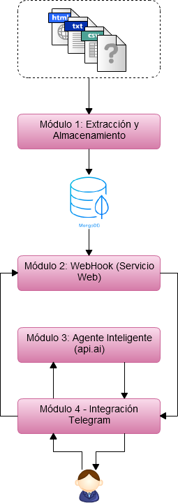

# Asistente virtual para información económica municipal

## Descripción

Módulo 1 - Extracción y Almacenamiento
Módulo 2 - WebHook (Servicio Web)
Módulo 3 - Agente Inteligente (api.ai)
Módulo 4 – Integración Telegram

## Guía de uso

El documento es una guía en sí. Por lo que su lectura y comprensión es muy sencilla.

## Equipo

- Autor principal:
  - Arnau Campos Albuixech
  - Valeria Alexandra Haro Valle
- Director del proyecto:
  - [Diego Álvarez](https://about.me/diegoalsan) | @diegoalsan

## Contexto del proyecto

El trabajo que contiene este repositorio se ha desarrollado en el [**Àrea Hackers cívics**](http://civichackers.cc). Un espacio de trabajo colaborativo formado por [hackers cívics](http://civichackers.webs.upv.es/conocenos/que-es-una-hacker-civicoa/) que buscamos y creamos soluciones a problemas que impiden que los ciudadanos y ciudadanas podamos influir en los asuntos que nos afectan y, así, construir una sociedad más justa. En definitiva, abordamos aquellos retos que limitan, dificultan o impiden nuestro [**empoderamiento**](http://civichackers.webs.upv.es/conocenos/una-aproximacion-al-concepto-de-empoderamiento/).

El [**Àrea Hackers cívics**](http://civichackers.cc) ha sido impulsada por la [**Cátedra Govern Obert**](http://www.upv.es/contenidos/CATGO/info/). Una iniciativa surgida de la colaboración entre la Concejalía de Transparencia, Gobierno Abierto y Cooperación del Ayuntamiento de València y la [Universitat Politècnica de València](http://www.upv.es).

 

## Términos de uso

El contenido de este repositorio está sujeto a la licencia [Creative Commons Attribution-ShareAlike 4.0 International License](https://creativecommons.org/licenses/by-sa/4.0/)

